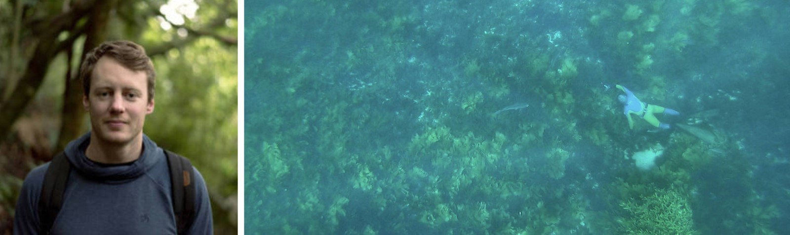

  
  
  
I'm a post-doc based in the [SALTT](https://blogs.unimelb.edu.au/saltt) lab in the School of BioSciences, University of Melbourne, Australia. I'm currently spread across a few time zones, working on a Norwegian Research Council Innovation Project awarded to Ole Folkedal (Institute of Marine Research / Havforskningsinstituttet) and Eide Fjordbruk AS, and contracting with [The Nature Conservancy](https://www.nature.org/en-us/what-we-do/our-insights/perspectives/how-investors-can-turn-the-tide-on-aquaculture/) to produce some research on the potential value of bivalve and seaweed aquaculture globally.
  
In my spare time I can be found in the ocean, up a mountain, or tinkering in the shed.
  
I like collaborating and sharing research, so feel free to get in touch by [email](luke.barrett@unimelb.edu.au) or follow me to see what I've been up to:  
  
[Google Scholar](https://scholar.google.ca/citations?hl=en&pli=1&user=m2VurpgAAAAJ)  
[ResearchGate](https://www.researchgate.net/profile/Luke_Barrett)  
[Twitter](https://www.twitter.com/LukeBarrettSci)  
[Instagram](https://www.instagram.com/barrettphoto/)  
  
I also have a photography portfolio website [here](https://lukebarrett.com)!  
  
