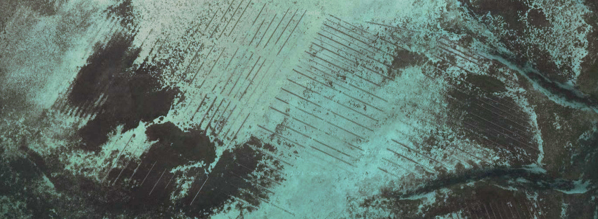

I do research to drive more sustainable use of the coastal marine environment. I'm especially interested in understanding the role that shellfish and seaweed aquaculture can play in providing sustainable seafood into the future, how ongoing expansion of aquaculture will affect coastal ecosystems and wildlife, and how to improve animal welfare in fish farming. When I get a chance, I also like to work on the conservation of temperate reef ecosystems.  

  

**Theme 1: Role of aquaculture sites as habitat for wildlife**  
Aquaculture modifies coastal marine environments by providing structure and food and altering nutrient dynamics. A better understanding of these effects can help achieve more positive outcomes, mitigate negative impacts, and provide a net enhancement of ecosystem services for coastal communities. *Recent research: [Barrett et al. 2019](https://doi.org/10.1111/raq.12277)*  
  
**Theme 2: Fish health in salmon farming**  
Intensive salmon farming has brought great economic benefits, but also problems. Salmon farms amplify pathogens and parasites, especially sea lice, causing welfare issues and production losses for farmed salmon and threatening wild salmonid populations around heavily infested farms. New methods are needed to prevent, monitor and treat infestations while maintaining high animal welfare standards. *Recent research: [Barrett et al. 2020](http://dx.doi.org/10.1111/raq.12456)*  
  
**Theme 3: Temperate reef ecology, conservation and restoration**  
Seaweed and kelp habitats are diverse and productive, but have come under threat from multiple stressors including eutrophication, sedimentation and overgrazing. I'm interested in the conservation of seaweed habitats in degraded coastal areas, including the role of invasive macroalgae as surrogate habitat and strategies to manage overabundant sea urchins and allow recovery of kelp ecosystems. *Recent research: [Barrett et al. 2019](https://doi.org/10.1002/eap.1956)*  
