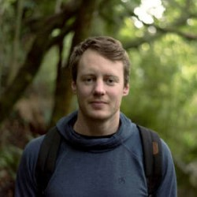
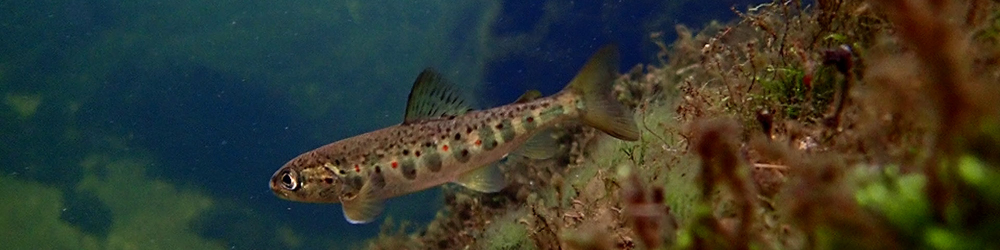
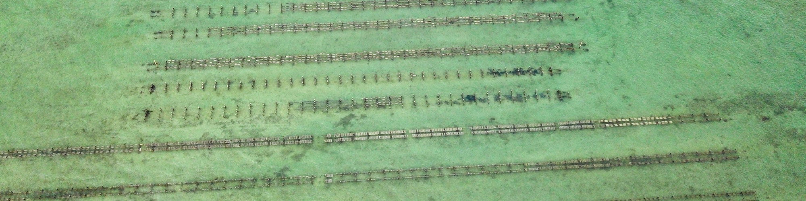
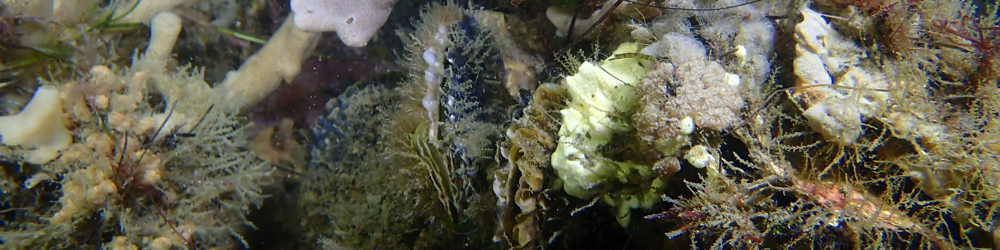
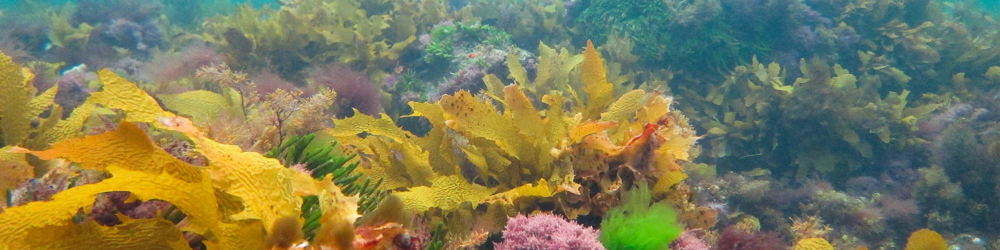

:::: {.columns}

::: {.column width="25%"}
{style="border-radius: 50%; width: 100%; max-width: 180px;"}
:::

::: {.column width="5%"}
:::

::: {.column width="70%"}
**Dr Luke T Barrett, PhD**

Research Fellow · Deakin University

[Google Scholar](https://scholar.google.com/citations?user=m2VurpgAAAAJ&hl=en) | [ORCiD](https://orcid.org/0000-0002-2820-0421) | [LinkedIn](https://www.linkedin.com/in/luke-t-barrett/) | [ResearchGate](https://www.researchgate.net/profile/Luke_Barrett)
:::

::::

## About

I do research to drive more sustainable use of the coastal marine environment, with a special interest in aquaculture. I'm currently a postdoctoral research fellow in the SALTT lab at Deakin University in Australia.

**Theme 1: Fish health and parasite control in salmon aquaculture**
Intensive salmon farming brings economic benefits, but also problems. Salmon farms amplify pathogens and parasites, including sea lice, which cause welfare issues in farmed salmon and threaten wild populations (we estimate that 99% of salmon lice in Norwegian waters originate from salmon farms). New methods are needed to prevent, monitor and treat infestations without compromising animal welfare standards.

{fig-alt="Photo of a salmon parr in a Norwegian River"}

**Theme 2: Ecologically beneficial aquaculture**
Aquaculture modifies coastal marine environments by providing structure and food and altering nutrient dynamics. A better understanding of these effects can help achieve more positive outcomes, mitigate negative impacts, and provide a net enhancement of ecosystem services for coastal communities.

{fig-alt="Photo of floating oyster baskets at Coffin Bay"}

**Theme 3: Oyster reef restoration**
Native flat oysters (*Ostrea angasi*) once formed extensive reefs in bays and estuaries across southern Australia, before post-colonial dredge fisheries removed the living oysters along with centuries worth of old shell that had built up to form the reefs. We are investigating ways to optimise restoration, including targeting intertidal areas to lower restoration costs and facilitate engagement.

{fig-alt="Photo of angasi oysters on reef in Corner Inlet"}

**Theme 4: Rocky reef ecology, conservation and restoration**
Seaweed and kelp habitats are diverse and productive, but have come under threat from multiple stressors including eutrophication, sedimentation and overgrazing. I'm interested in the conservation of seaweed habitats in degraded coastal areas, including the role of invasive macroalgae as surrogate habitat and strategies to manage overabundant sea urchins and allow recovery of kelp ecosystems.

{fig-alt="Photo of healthy Ecklonia kelp canopy in Port Phillip Bay"}

## Publications

1. Overton K, Dempster T, Vindas M, Oppedal F, **Barrett LT** (2026) Existing soundscapes and the impact of noise on the welfare of farmed salmonids: a review. [*Reviews in Aquaculture*](http://dx.doi.org/10.1111/raq.70139). Open access.

1. Overton K, **Barrett LT**, Oppedal F, Oldham T, Geitung L, Gismervik K, Dempster T (2026) The rise and fall of cleaner fish use in Norwegian salmon farming. [*Aquaculture Environment Interactions*](https://doi.org/10.3354/aei00520). Open access.

1. Overton K, Harvey M, Dempster T, Swearer SE, Morris RL, **Barrett LT** (2026) Interspecific facilitation, elevation gradient, and site influence intertidal *Ostrea angasi* survival and growth. [*Restoration Ecology*](https://doi.org/10.1111%2Frec.70341). Open access.

1. Hvas M, **Barrett LT**, Gjerde LM, Vågseth T, Oppedal F, Folkedal O (2025) Heart rates, activity, and welfare of Atlantic salmon reared to harvest size in a semi-closed prototype sea-cage or ambient conditions. [*Aquaculture*](https://doi.org/10.1016/j.aquaculture.2025.743601). Open access.

1. **Barrett LT**, Jensen MF, Dalvin S, Oppedal F (2025) Behaviour and dispersal of mobile salmon lice when detached from the host. [*Journal of Fish Diseases*](https://doi.org/10.1111/jfd.14143). Open access.

1. Overton K, Dempster T, Swearer SE, **Barrett LT** (2025) Post-release survival of marine gastropods: a review. [*Biological Conservation*](https://doi.org/10.1016/j.biocon.2025.111153). Open access.

1. Geitung L, **Barrett LT**, Nola V, Dalvin S, Vatne Martinsen L, Dahlgren A, Oppedal F (2025) Crowding causes detachment and loss of mobile sea lice: fine-meshed crowding nets may mitigate spread. [*Aquaculture Reports*](https://doi.org/10.1016/j.aqrep.2025.102784). Open access.

1. **Barrett LT**, Oppedal F (2025) Characterisation of the underwater soundscape at Norwegian salmon farms. [*Aquaculture*](https://doi.org/10.1016/j.aquaculture.2025.742334). Open access.

1. **Barrett LT**, Oppedal F, Harvey M, Eichner C, Sambraus F, Dalvin S (2025) Collection rates of detached mobile sea lice according to net mesh and body size: a benchtop model. [*Aquacultural Engineering*](https://doi.org/10.1016/j.aquaeng.2025.102514). Open access.

1. Dalvin S, Oppedal F, Harvey M, **Barrett LT** (2025) Salmon lice detached during aquaculture practices survive and can reinfest other hosts. [*Aquaculture*](https://doi.org/10.1016/j.aquaculture.2024.742065). Open access.

1. Loebmann A, Geitung L, **Barrett LT**, Oppedal F, Dempster T (2025) Jump nets passively isolate lice-infected salmon and enable targeted treatment using cleaner fish. [*Aquaculture*](https://doi.org/10.1016/j.aquaculture.2024.741901). Open access.

1. Overton K, Dempster T, Swearer SE, Morris RL, **Barrett LT** (2024) Predictors of outplanted marine bivalve survival in restoration: a review and synthesis. [*Journal of Applied Ecology*](https://doi.org/10.1111/1365-2664.14795). Open access.

1. **Barrett LT**, Unneland Larsen L-T, Bui S, Vågseth T, Eide E, Dempster T, Oppedal F, Folkedal O (2024) Post-smolt Atlantic salmon can regulate buoyancy in submerged sea-cages by gulping air bubbles. [*Aquacultural Engineering*](https://doi.org/10.1016/j.aquaeng.2024.102455). Open access.

1. Oppedal F, **Barrett LT**, Fraser TWK, Vågseth T, Zhang G, Andersen OG, Jacson L, Dieng M-A, Vindas MA (2024) The behavioral and neurobiological response to sound stress in salmon. [*Brain, Behavior and Evolution*](https://doi.org/10.1159/000539329). Open access (Editor's Choice).

1. Loebmann A, **Barrett LT**, Oppedal F, Dempster T (2024) A passive fish sampling method is representative for size but selective for parasite load. [*Aquaculture*](https://doi.org/10.1016/j.aquaculture.2024.741295). Open access.

1. Harvey M, **Barrett LT**, Morris RL, Swearer SE, Dempster T (2024) Ocean sprawl: The global footprint of shellfish and algae aquaculture and its implications for production, environmental impact, and biosecurity. [*Aquaculture*](https://doi.org/10.1016/j.aquaculture.2024.740747). Open access.

1. Overton K, Dempster T, Swearer SE, Morris RL, **Barrett LT** (2023) Aerial exposure tolerance of juvenile flat oysters (*Ostrea angasi*) depends on shell length and air temperature. [*Restoration Ecology*](https://doi.org/10.1111/rec.14047). Open access.

1. Robinson N, Østbye TKK, Kettunen AH, Coates A, **Barrett LT**, Robledo D, Dempster T (2023) A guide to assess the use of gene editing in aquaculture. [*Reviews in Aquaculture*](https://doi.org/10.1111/raq.12866). Open access.

1. Overton K, Dempster T, Swearer SE, Morris RL, **Barrett LT** (2023) Achieving conservation and restoration outcomes through ecologically beneficial aquaculture. [*Conservation Biology*](https://doi.org/10.1111/cobi.14065). Open access.

1. Nilsson J, **Barrett LT**, Mangor-Jensen A, Nola V, Harboe T, Folkedal O (2023) Effect of water temperature and exposure duration on detachment rate of salmon lice (*Lepeophtheirus salmonis*); testing the relevant thermal spectrum used for delousing. [*Aquaculture*](https://doi.org/10.1016/j.aquaculture.2022.738879). Open access.

1. Robinson N, Robledo D, Sveen L, Daniels R, Krasnov A, Coates A, Jin Y, **Barrett LT**, Lillehammer M, Kettunen A, Phillips B, Dempster T, Doeschl-Wilson A, Samsing F, Difford G, Salisbury S, Gjerde B, Haugen J-E, Burgerhout E, Dagnachew B, Kurian D, Fast MD, Rye M, Salazar M, Bron JE, Monaghan S, Jacq C, Birkett M, Browman H, Skiftesvik A, Fields D, Selander E, Bui S, Sonesson A, Skugor S, Knutsdatter Østbye T-K, Houston R (2022) Applying genetic technologies to combat infectious diseases in aquaculture. [*Reviews in Aquaculture*](https://doi.org/10.1111/raq.12733). Open access.

1. Lennox RJ, **Barrett LT**, Nilsen C, Berhe S, Barlaup B, Vollset KW (2022) Moving cleaner fish from the wild into fish farms: a zero-sum game? [*Ecological Modelling*](https://doi.org/10.1016/j.ecolmodel.2022.110149). Open access.

1. Macaulay G, **Barrett LT**, Dempster T (2022) Recognising trade-offs between welfare and environmental outcomes in aquaculture will enable good decisions. [*Aquaculture Environment Interactions*](https://doi.org/10.3354/aei00439). Open access.

1. **Barrett LT**, Oldham T, Kristiansen TS, Oppedal F, Stien LH (2022) Declining size-at-harvest in Norwegian salmon aquaculture: lice, disease, and the role of stunboats. [*Aquaculture*](https://doi.org/10.1016/j.aquaculture.2022.738440). Open access.

1. Oppedal O, Stien LH, Bui S, Oldham T, **Barrett LT** (2022) Physical prevention and control of sea lice. Book chapter in: Sea Lice Biology and Control (edited by J Treasurer et al.). [5m Books](https://5mbooks.com/product/sea-lice-biology-and-control). [[email for pdf]](mailto:l.barrett@deakin.edu.au)

1. Wilson S, Fulton C, Graham N, Abesamis R, Berkström C, Coker D, Depczynski M, Evans R, Fisher R, Goetze J, Hoey A, Holmes T, Kulbicki M, Noble M, Robinson J, Bradley M, Åkerlund C, **Barrett LT**, Birt M, Bucol A, Chacin D, Chong-Seng K, Eggertsen L, Eggertsen M, Ellis D, Leung P, Lam P, van Lier J, Matis P, Pérez-Matus A, Piggott C, Radford B, Tano S, Tinkler P (2022) The contribution of macroalgal associated fishes to small-scale tropical reef fisheries. [*Fish and Fisheries*](http://doi.org/10.1111/faf.12653). Open access.

1. McIntosh P, **Barrett LT**, Warren-Myers F, Coates A, Macaulay G, Szetey A, Robinson N, White C, Samsing F, Oppedal F, Folkedal O, Klebert P, Dempster T (2022) Supersizing salmon farms in the coastal zone: a global analysis of changes in farm technology and location from 2005 to 2020. [*Aquaculture*](https://doi.org/10.1016/j.aquaculture.2022.738046). [[email for pdf]](mailto:l.barrett@deakin.edu.au)

1. **Barrett LT**, Theuerkauf SJ, Rose JM, Alleway HK, Bricker SB, Parker M, Petrolia DR, Jones RC (2022) Sustainable growth of non-fed aquaculture can generate valuable ecosystem benefits. [*Ecosystem Services*](https://doi.org/10.1016/j.ecoser.2021.101396). Open access.

1. Swearer SE, Morris RL, **Barrett LT**, Sievers M, Dempster T, Hale R (2021) An overview of ecological traps in marine ecosystems. [*Frontiers in Ecology and the Environment*](https://doi.org/10.1002/fee.2322). [[email for pdf]](mailto:l.barrett@deakin.edu.au)

1. Macaulay G, Warren-Myers F, **Barrett LT**, Oppedal F, Føre M, Dempster T (2021) Tag use to monitor fish behaviour in aquaculture: a review of benefits, problems, and solutions. [*Reviews in Aquaculture*](https://doi.org/10.1111/raq.12534). [[email for pdf]](mailto:l.barrett@deakin.edu.au)

1. Dempster T, Overton K, Bui S, Stien LH, Oppedal F, Karlsen Ø, Coates A, Phillips BL, **Barrett LT** (2021) Farmed salmonids drive the abundance, ecology and evolution of parasitic salmon lice in Norway. [*Aquaculture Environment Interactions*](https://doi.org/10.3354/aei00402). Open access.

1. Theuerkauf SJ, **Barrett LT**, Alleway HK, Costa-Pierce B, St. Gelais A, Jones R (2021) Habitat value of bivalve shellfish and seaweed aquaculture for fish and invertebrates: pathways, synthesis, next steps. [*Reviews in Aquaculture*](https://doi.org/10.1111/raq.12584). Open access.

1. **Barrett LT**, Swearer SE, Dempster T (2020) Native predator limits the capacity of an invasive seastar to exploit a food-rich habitat. [*Marine Environmental Research*](https://doi.org/10.1016/j.marenvres.2020.105152). [[pdf]](pdfs/Barrett-et-al-2020-MERE-seastars.pdf)

1. **Barrett LT**, Oppedal F, Robinson N, Dempster T (2020) Prevention not cure: a review of methods to avoid sea lice infestations in salmon aquaculture. [*Reviews in Aquaculture*](http://dx.doi.org/10.1111/raq.12456). [[pdf]](pdfs/Barrett-et-al-2020-RAQ-prev-methods.pdf)

1. Bui S, Geitung L, Oppedal F, **Barrett LT** (2020) Salmon lice survive the straight shooter: efficacy of laser delousing in commercial sea cages. [*Preventive Veterinary Medicine*](https://doi.org/10.1016/j.prevetmed.2020.105063). Open access.

1. Bui S, Oppedal F, Nola V, **Barrett LT** (2020) Where art thou louse? A snapshot of attachment location preferences in salmon lice on Atlantic salmon hosts in sea cages. [*Journal of Fish Diseases*](https://doi.org/10.1111/jfd.13167). Open access.

1. Fulton CJ, Berkström C, Wilson SK, Abesamis RA, Bradley M, Åkerlund C, **Barrett LT**, Bucol AA, Chacin DH, Chong-Seng KM, Coker DJ, Depczynski M, Eggertsen L, Eggertsen M, Ellis D, Evans RD, Graham NAJ, Hoey AS, Holmes TH, Kulbicki M, Leung PTY, Lam PKS, van Lier J, Matis PA, Noble MM, Pérez-Matus A, Piggott C, Radford BT, Tano S, Tinkler P (2020) Macroalgal meadow habitats support fish and fisheries in diverse tropical seascapes. [*Fish and Fisheries*](https://dx.doi.org/10.1111/faf.12455). [[pdf]](pdfs/Fulton-et-al-2020-FishandFisheries-seaweed.pdf)

1. **Barrett LT**, Overton K, Stien LH, Oppedal F, Dempster T (2020) Effect of cleaner fish on sea lice in Norwegian salmon aquaculture: a national scale data analysis. [*International Journal for Parasitology*](https://doi.org/10.1016/j.ijpara.2019.12.005). [[pdf]](pdfs/Barrett-et-al-2020-IJPara-cleaner-fish.pdf)

1. Overton K, **Barrett LT**, Oppedal F, Kristiansen TS, Dempster T (2020) Sea lice removal by cleaner fish in salmon aquaculture: a review of the evidence base. [*Aquaculture Environment Interactions*](https://doi.org/10.3354/aei00345). Open access.

1. Hassell K, **Barrett LT**, Dempster T (2020) Impacts of human-induced pollution on wild fish welfare. Book chapter in: [The Welfare of Fish](https://www.springer.com/gp/book/9783030416744#aboutBook) (edited by T Kristiansen et al.). Springer.

1. **Barrett LT**, Bui S, Oppedal F, Bardal T, Olsen RE, Dempster T (2020) Ultraviolet-C light suppresses reproduction of sea lice but has adverse effects on host salmon. [*Aquaculture*](https://doi.org/10.1016/j.aquaculture.2020.734954). [[pdf]](pdfs/Barrett-et-al-2020-Aquaculture-UVC.pdf)

1. **Barrett LT**, Pert CG, Bui S, Oppedal F, Dempster T (2020) Sterilization of sea lice eggs with ultraviolet C light: towards a new preventative technique for aquaculture. [*Pest Management Science*](https://doi.org/10.1002/ps.5595). [[pdf]](pdfs/Barrett-et-al-2019-PMS-UVC.pdf)

1. **Barrett LT**, Dempster T, Swearer SE (2019) A nonnative habitat-former mitigates native habitat loss for endemic reef fishes. [*Ecological Applications*](https://doi.org/10.1002/eap.1956). [[pdf]](pdfs/Barrett-et-al-2019-EcolApps-wakame.pdf)

1. **Barrett LT**, Swearer SE, Dempster T (2019) Impacts of marine and freshwater aquaculture on wildlife: a global meta-analysis. [*Reviews in Aquaculture*](https://doi.org/10.1111/RAQ.12277). [[pdf]](pdfs/Barrett-et-al-2019-RAQ-wildlife.pdf)

1. **Barrett LT**, Swearer SE, Harboe T, Karlsen Ø, Meier S, Dempster T (2018) Limited evidence for differential reproductive fitness of wild Atlantic cod in areas of high and low salmon farming density. [*Aquaculture Environment Interactions*](https://doi.org/10.3354/aei00275). Open access.

1. **Barrett LT**, de Lima A, Goetze JS (2018) Evidence of a biomass hotspot for targeted fish species within Namena Marine Reserve, Fiji. [*Pacific Conservation Biology*](https://doi.org/10.1071/PC18034). [[pdf]](pdfs/Barrett-et-al-2018-PCB-Fiji.pdf)

1. Dempster T, Arechavala-Lopez P, **Barrett LT**, Fleming IA, Sanchez-Jerez P, Uglem I (2018) Recapturing escaped fish from marine aquaculture is largely unsuccessful: alternatives to reduce the number of escapees in the wild. [*Reviews in Aquaculture*](https://doi.org/10.1111/raq.12153). [[pdf]](pdfs/Dempster-et-al-2018-RAQ-escapes.pdf)

1. **Barrett LT**, Evans JP, Gasparini C (2014) The effects of perceived mating opportunities on patterns of reproductive investment by male guppies. [*PLoS ONE*](https://doi.org/10.1371/journal.pone.0093780). Open access.

## Grants

**2026**  
*Title*: Uncertainty and improvement of manual sea lice counting – basis for validation of automatic counting systems (LuseMet)  
*Funder*: Norwegian Seafood Research Fund (FHF) project 910731  
*Role*: Work package lead

**2024**  
*Title*: Forebygging og kontroll med lus – et dypdykk i effekt og fiskehelse ved bruk av laser (ContrlLaser)  
*Funder*: Norwegian Seafood Research Fund (FHF) project 901985  
*Role*: Work package lead

**2024**  
*Title*: Developing the tools and knowledge required for sustainable submerged salmon production (SafeSubmergence)  
*Funder*: Norwegian Seafood Research Fund (FHF) project 901933  
*Role*: Work package lead

**2023**  
*Title*: Optimizing fish welfare and protective efficacy when using lice barrier technologies (BetterWel)  
*Funder*: Norwegian Seafood Research Fund (FHF) project 901878  
*Role*: Work package lead

**2023**  
*Title*: Standard Operating Procedure for validation of automatic lice counts (AutoSOP)  
*Funder*: Norwegian Seafood Research Fund (FHF) project 901881  
*Role*: Work package lead

**2023**  
*Title*: Best practice for prevention and control of sea lice (LusePraksis)  
*Funder*: Norwegian Seafood Research Fund (FHF) project 901858  
*Role*: Work package lead

**2022**  
*Title*: Lice collection and re-infection in the sea (LuseOppsamlingSjø)  
*Funder*: Norwegian Seafood Research Fund (FHF) project 901784  
*Role*: Work package lead

**2021**  
*Title*: Tying the knot: unifying behavior, environment and technology for optimal site management (PreventLice)  
*Funder*: Norwegian Seafood Research Fund (FHF) project 901685  
*Role*: Work package lead

**2015**  
*Title*: Ecological effects of an invasive seaweed in Port Phillip Bay  
*Funder*: Victorian Environmental Assessment Council: Bill Borthwick Student Scholarship  
*Role*: Lead (student grant)

**2015**  
*Title*: Invasive kelp patches: traps or refuges for fish on degraded reefs?  
*Funder*: PADI Foundation Grant  
*Role*: Lead (student grant)

**2015**  
*Title*: Invasive macroalgal habitats: traps or refuges for endemic fish on degraded reefs?  
*Funder*: Holsworth Wildlife Research Endowment  
*Role*: Lead (student grant)

**2014**  
*Title*: Attraction, predation and production of native and invasive seastars on mussel farms in Victoria  
*Funder*: Holsworth Wildlife Research Endowment  
*Role*: Lead (student grant)

## Education

**2018: PhD | Marine Ecology**  
University of Melbourne  
*Habitat preferences and fitness consequences for fauna associated with novel marine environments*

**2013: BSc (Honours) | Zoology and Marine Biology**  
University of Western Australia  
*Effect of expected future mating opportunities on patterns of reproductive investment by male guppies*
